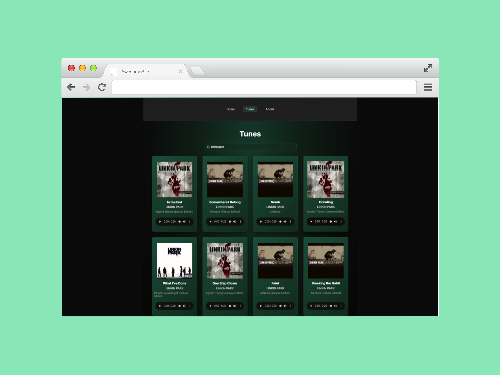

# Tunes Music App



A modern music search application built with React and TypeScript, powered by the iTunes API.

## 🎵 Features

- Search for songs, artists, and albums
- Preview 30-second audio clips
- Real-time search with debouncing
- Load more results dynamically
- Responsive grid layout
- Modern mint-themed UI with glassmorphism effects

## 🛠️ Tech Stack

- React 19
- TypeScript
- Styled Components
- React Router v6
- Vite
- iTunes Search API

## 🚀 Installation

```bash
npm install
npm run dev
```

## 📦 Build

```bash
npm run build
```

## 🌐 Deploy

```bash
npm run deploy
```

Deployed at: [https://alena0490.github.io/music-app/](https://alena0490.github.io/music-app/)

## 📝 License

MIT

```---

**GitHub Description (Music search app with React, TypeScript & iTunes API):**
```

🎵 Modern music search app built with React, TypeScript, and iTunes AP
